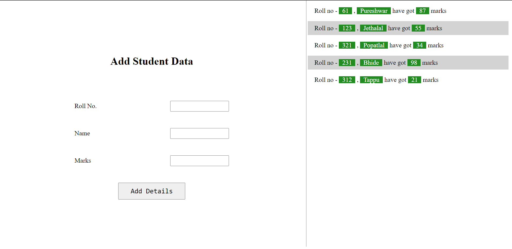

# Mini Project - Upload Details

## [Live](https://pureshwargonekar.github.io/Upload-Details/)

This the mini project which takes some details in the form and after uploading the details, the item listed in the right container. This is all implemented using HTML, CSS, JavaScript and jQuery.

jQuery is used to add the runtime list after submitting(or uploading) the form.

## Screenshot
